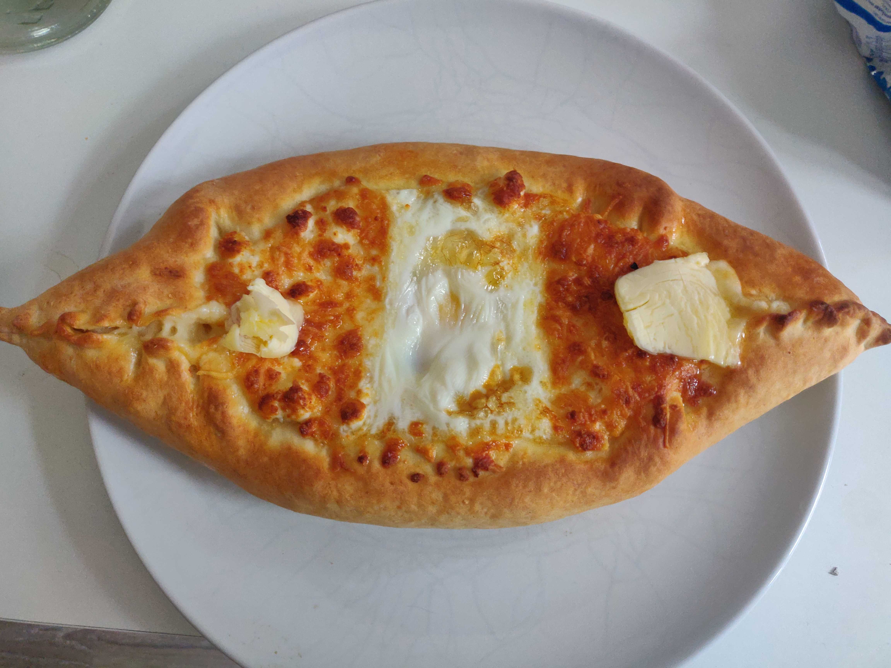

# Khachapuri

Based on [this recipe by Irma Iantbelidze](https://georgianrecipes.com/recipes/Adjarian-khachapuri/).
Serves 2.

## Ingredients

- 150g all-purpose flour
- 75ml warm water
- 5g dry yeast
- 1/2 tsp salt
- 1/2 tsp oil
- 250g cheese (I found that a mix of feta and dry mozzarella works pretty well to replicate the taste of Georgian cheese)
- 1 egg 
- 1 tbsp butter

## Preparations

- Combine flour, water, yeast, and salt. Knead into a stiff dough.
- Sprinkle with a little oil, cover, and let rest. Depending on room temperature, this may take 1-2 hours.
- In the meanwhile, grate/crumble the cheese mix.

## Cooking & Assembly

- Preheat oven to 220 degrees Celsius.
- Roll out the dough into a rectangular-/oval-ish shape. Roll the edges inwards and pinch the two ends to form a boat shape. (Or do what Chef John does and create a [cheese-stuffed crust](https://foodwishes.blogspot.com/2019/03/khachapuri-georgia-cheese-bread-on-my.html))
- Transfer this to a baking-paper lined oven tray, and fill the boat with cheese mix.
- Bake for 15 minutes, till the top starts to turn golden brown.
- Take it out of oven, make a small well in the cheese mix, and crack an egg inside.
- Bake for another 3-5 minutes until the egg starts to set.
- Add a slice of butter for extra flavour, and enjoy.

With stuffed crust:

Without stuffed crust:

