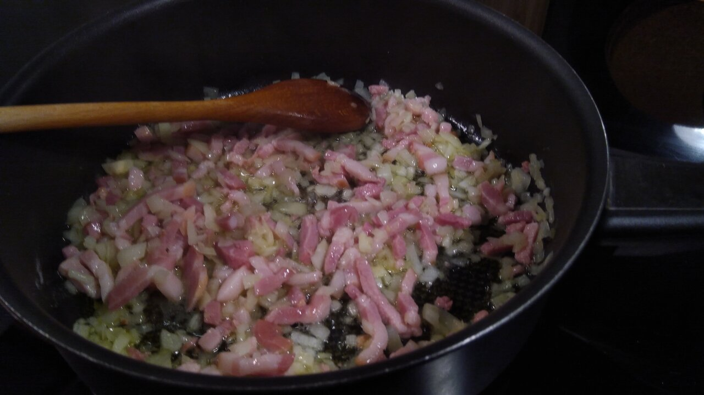

# Hungarian Lecsó

(letter cs - **ch**eck, et**ch**ing)

## Ingredients

- olive oil
- 150g chopped bacon
- ginger, small knob
- 2-3 garlic
- 2 small onion (or one big)
- about 600g paprika/bell pepper (2 big bell pepper)
- 5-6 smaller tomato
- 1 tbsp sweet Hungarian paprika powder (edelsüss)
- 1/4 tsp salt
- 2 egg (optional)
- black pepper, oregano, basil, marjoram (optional)
- Hungarian sausage (optional)

You need a cooking pot with **lid**.

## Preparations

- chop 2 small onion (or one big)
- chop 2-3 garlic
- chop the ginger (small knob)
- slice about 600g paprika/bell pepper to few cm slices
- slice tomato

Recommended to finish all preparations before cooking.

## Cooking

1) With some olive oil, cook the chopped onion on medium heat, then add the chopped bacon and cook for a few minutes

2) Add a little black pepper powder
3) Add the sliced paprika
4) Add tomato (can leave out some to add at the end)
5) Add 1/4 tsp salt and 1 tbsp sweet Hungarian pepper powder
5) (optional) Add rest of the spices

5) Add 1dl water, **close the lid** and cook for another 30-40 minutes, stirring occasionally, or until mixture resembles chunky tomato sauce.
7) (optional) Add fresh sliced tomato, eggs and/or Hungarian sausage and cook for a few more minutes so he egg is fully cooked.

Serve with a few slice of bread or cooked rice.

