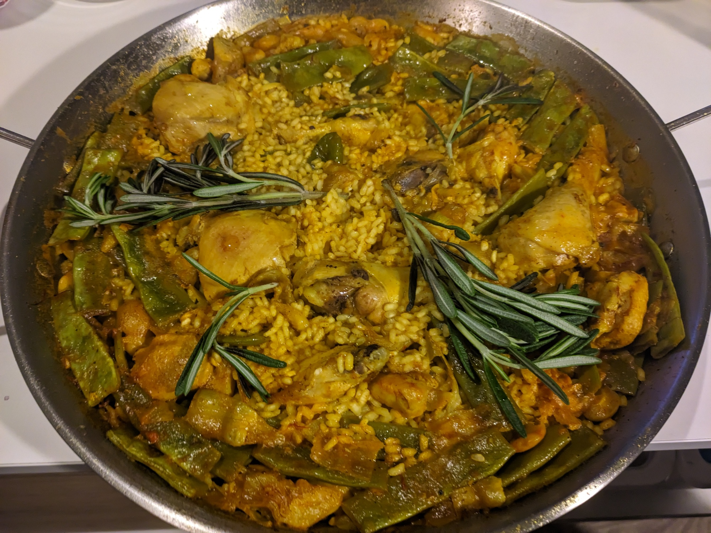

# Paella Valenciana

Valencia is one of my favourite cities. On our last visit we went to a cooking class at [Valencia Club Cocina](https://www.valenciaclubcocina.com/) to learn how to make paella.

We bought a 26 cm stainless steel paella pan from a supermarket in Valencia, though we don't have the special gas range for cooking paella like in professional kitchens.

This recipe makes two servings.

## Ingredients

- 250g rice (albufera or senia, don't use bomba)
- 300g bone-in chicken
- 150g rabbit (or substitute with more chicken)
- 150g flat green beans (Ferraúra is the original variety, but any flat green beans will do)
- 50g lima beans or butter beans
- (optional) 3 artichoke hearts, cut into quarters
- 3 cloves garlic, minced
- 2 teaspoons concentrated tomato puree
- 75 ml olive oil
- a few strands of saffron
- 1 tsp sweet paprika powder
- 1/2 tsp turmeric (or food colouring)
- 2 sprigs of rosemary

## Preparations

- If using dried lima beans, soak them overnight.
- Clean the green beans and cut into bite-sized pieces (about 3-5cm each).
- If using dried lima beans, boil them for 30 min (or 10 minutes in the pressure cooker). If using canned lima beans, just rinse them.
- Clean the chicken and rabbit, and cut into even pieces.
- Turn on heat, spread some salt on the edges of the pan. This will help avoid sticking.
- Add olive oil to the centre of the pan.
- Add chicken and rabbit pieces to the center of the pan. Stir occasionally and cook until browned.
- Move the meat pieces to the edge of the pan. If you have a small pan, just take it out and set aside.
- Add green beans, artichoke, and lima beans to the center of the pan.
- When veggies start to turn soft, move everything to the edge of the pan again.
- Turn heat as low as possible, and add minced garlic in the center along with saffron, turmeric, and paprika powder. Stir to combine
- Add pureed tomato around the spices, and mix. Be careful to not burn the saffron.
- When the tomato mixture start to turn into a fragrant brown paste, mix everything together in the pan, and scrape the brown bits on the bottom.
- Add 750 ml water (3 times of the amount of rice) to make a broth.
- Use a spoon to measure the height of the liquid in the pan. We'll need this measurement later.
- Adjust for salt. The broth should be slightly salty.
- Simmer for 20-25 min until most of the water is evaporated.
- Add more water, so the amount of liquid in the pan reaches the height we previously measured with a spoon.
- Add rice and stir for 1 min. After this refrain from moving the rice again.
- Add rosemary. Adjust seasoning if needed. 
- Cook on high heat for 10 min, followed by 5 min on medium heat.
- Finish off with medium-high heat for 1-2 min. The bottom should start to caramelise, producing "socarrat". This can be checked by poking the bottom of the pan with a spoon.
- Dig in!

